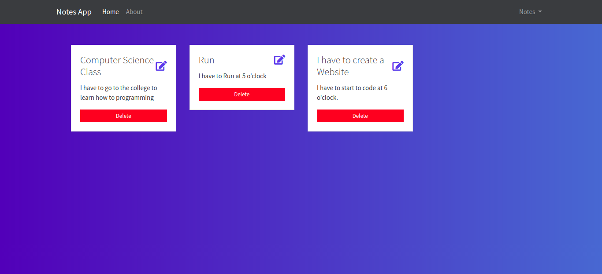

# Notes App NodeMongo

This is a basic App to manage simple Notes on the web using Javascript Technologies like Nodejs, Mongodb, and other related technologies.

This app can do:

- CRUD Operations: create/read/update/delete NotesCancel changes
- Allows a user to do login and save his personal notes

# Screenshot

# Environment Variables

This app needs the following environment Variables

- `MONGODB_HOST` this is the Mongodb URI string
- `MONGODB_DATABASE` Mongodb database name
- `NODE_ENV` node environment

## Default User

when the app is lauched, this will create an Admin user with the following credentials:

- email: admin@localhost
- password: adminpassword

